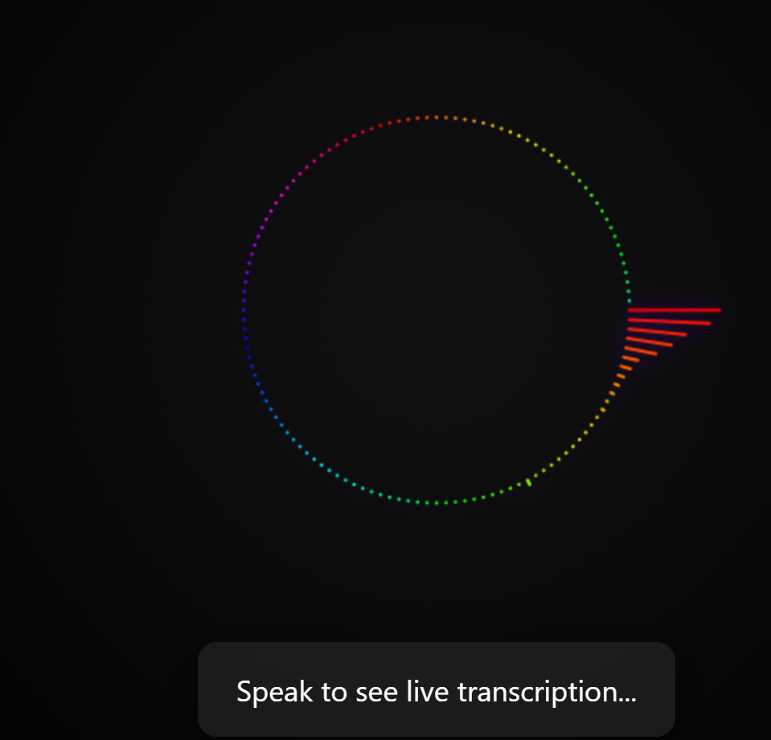

# 🎧 Real-Time Audio Visualizer & Streaming Transcription

This project demonstrates a real-time circular audio visualizer combined with low-latency streaming transcription using WebSockets and reactive backend architecture.

---

## 🚀 Features

- 🎤 Live microphone audio capture
- 🔵 Circular audio frequency visualizer (60 FPS)
- 🔄 Real-time bi-directional WebSocket communication
- 🧠 Streaming transcription (mocked Gemini behavior)
- ⚡ Low-latency, non-blocking backend using Spring WebFlux
- 🎨 Clean, modern, responsive UI

---

## 🏗️ Architecture Overview
```
Frontend (React)
├─ Web Audio API (AnalyzerNode)
├─ Canvas (Circular Visualizer)
├─ MediaRecorder (Audio Chunks)
└─ WebSocket Client
↓
Backend (Spring Boot + WebFlux)
├─ WebSocket Handler
├─ Non-blocking Flux Streams
└─ Gemini Streaming (Mocked)
↓
Frontend
└─ Live Transcription UI
```


---

## 🔄 Real-Time Streaming Flow

1. Frontend captures microphone audio.
2. Audio is split into small chunks (250ms).
3. Each chunk is sent immediately via WebSocket.
4. Backend processes chunks without buffering.
5. Partial transcription responses are streamed back.
6. Frontend updates UI in real time.

---

## 🧪 Mock Gemini Streaming

For demonstration purposes, Gemini streaming is mocked by emitting partial transcription words with controlled delays. This simulates real-world streaming transcription behavior while keeping the demo lightweight and reliable.

---

## 🛠️ Tech Stack

### Frontend
- React
- Web Audio API
- Canvas
- WebSocket API

### Backend
- Java 17
- Spring Boot
- Spring WebFlux
- Reactor (Flux / Mono)

---

## ⚡ Performance Considerations

- Small audio chunks for low latency
- Non-blocking I/O using WebFlux
- Efficient streaming without buffering
- Smooth 60 FPS rendering via requestAnimationFrame

---

## 🎥 Demo

The demo video showcases:
- Circular audio visualizer reacting to voice
- Live streaming transcription
- End-to-end WebSocket communication

---

## 🔮 Future Improvements

- Integrate real Gemini streaming API
- Noise suppression and echo cancellation
- Word confidence highlighting
- Adaptive chunk sizing
- Multiple visualizer themes

---
## ▶️ How to Run Locally

### Backend
```bash
cd backend
mvn spring-boot:run
``` 

### Frontend
```bash
cd frontend
npm install
npm start
```
## 📸 Screenshots



## 👤 Author

**GhostDeveloper404**  
Passionate full-stack developer focused on real-time systems, performance, and clean UI.

